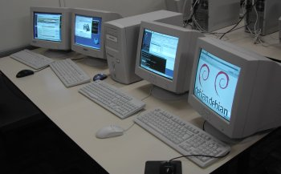
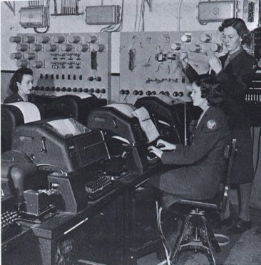
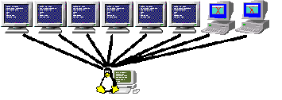

# 2. Boot process debugging, security and beyond - Linux-dz courses  (derja)

Video Link:

Djalal Harouni  -  https://github.com/tixxdz

Email for corrections here:  tixxdz+linuxdz@gmail.com  -  sorry if I do not reply to all emails.

Date: 10-04-2020

LastModified: Sat 11 Apr 2020 10:54:16 AM CET


## What is about ?

References:  https://training.linuxfoundation.org/training/fundamentals-of-linux/

Adapted to be easy with video in derja language, Algeria local dialect.

* Ghir important things!
   - Dirou research alone, no excuses!

* 3leh ?
   - Tal3ou niveau 

* Goal - Hadef ?
   - Debug Linux boot process and beyond
   - Services, security, logins and timers

* Teacher ?
   - Djalal Harouni - Open Source Software maintainer - systemd, linux kernel developer... wrote code used in millions of machines and devices.


## Plan

1) Linux Boot Process - Bootloader
   - Linux Kernel and initramfs
   - Init systemd and Services

2) Systemd run program at boot and timers (cron jobs)

3) Logins and session

4) Debug boot and Security


## 1. Linux boot process

BIOS - BIOS POST

Boot loader (grub2 - uboot for embedded, etc)

Linux kernel and initramfs (initrd)

Systemd  - only distributions with systemd


### 1.1 BIOS - BIOS POST

Basic I/O System  -  is hardware working ?

https://en.wikipedia.org/wiki/BIOS_interrupt_call

Find boot record load into ram and transfert execution 
to 2) Boot  loader


### 1.2 Boot loader (Grub2 - uboot for embedded, etc)

Grub2 (GRand Unified Bootloader, version 2)
	
No more multiple stages: https://www.gnu.org/software/grub/manual/grub/grub.html

Load Linux kernel and initrd (initramfs)

Files and configs:  /boot/grub2/

Find kernel and initramfs (initial kernel ramdisk) load in ram
and transfert execution  to 3) Linux kernel


### 1.3 Linux kernel and initramfs

Kernel can be compressed “vmlinuz” (Z) self extracting or uncompressed
“vmlinux” image. Located in /boot/

Initramfs (initrd) image - basic root file system and modules need by kernel

Make sure to backup your old initrd first.

```bash
mkinitrd -o /boot/initrd.img-$(uname -r) $(uname -r)
mkinitrd -o /boot/initrd.img-4.19 4.19
```

Kernel detects and initializes hardware

Kernel reads disks detects the root file system and replaces initramfs

Kernel starts its threads and transfert execution to 
4)  INIT Program /sbin/init 	 

```bash
$ ls -lha /sbin/init
lrwxrwxrwx 1 root root 20 Oct 16 14:24 /sbin/init -> /lib/systemd/systemd
```

### 1.4 Systemd init -  only distributions with systemd

Parent of all processes.

Sets up the machine

[Bootup targets order](http://man7.org/linux/man-pages/man7/bootup.7.html)

Sysinit.target, basic.target, multi-user.target and graphical.target

systemd  - journald tools , systemd-cgls and others.


## 2 Systemd run program at boot and timers (cron jobs)

### 2.1 Example service or program running during each boot:

File [hello-world.service](../systemd/units/hello-world.service)

```
[Unit]
Description=Hello World Service

[Service]
ExecStart=/bin/bash -c 'for i in {1..30}; do echo "Hello at $(date)"; sleep 3; done'

[Install]
WantedBy=multi-user.target
```

Installation commands:
```bash
sudo cp hello-world.service /etc/systemd/system/
sudo systemctl daemon-reload
sudo systemctl enable hello-world.service
sudo systemctl start hello-world.service
```

Stop:
```bash
sudo systemctl stop hello-world.service
```

Disable:
```bash
sudo systemctl disable hello-world.service
```


NetworkManager File [NetworkManager.Service](../systemd/units/NetworkManager.service) example.

```bash
cat /lib/systemd/system/NetworkManager.service
```


### 2.2 Example timer service (cron job)

[systemd timer services instead of cron jobs](https://www.freedesktop.org/software/systemd/man/systemd.timer.html)

Example  timer-hello-world timer service  -  execute each 30 seconds

File [timer-hello-world.service](../systemd/unit/timer-hello-world.service)

```
[Unit]
Description=Timer hello world - Service unit

[Service]
Type=oneshot
ExecStart=/usr/bin/echo "Timer hello world at $(date)"

[Install]
WantedBy=multi-user.target
```

**Note: service type is oneshot (execute command and exit) if not then you do not need timers nor cron jobs**


File [timer-hello-world.timer](../systemd/unit/timer-hello-world.timer)

```
[Unit]
Description=Timer hello world - Timer unit

[Timer]
OnBootSec=1min
OnUnitActiveSec=30sec

[Install]
WantedBy=timers.target
```

Install timer service commands:

```bash
sudo cp timer-hello-world.service /etc/systemd/system/
sudo cp timer-hello-world.timer /etc/systemd/system/
sudo systemctl daemon-reload
sudo systemctl enable timer-hello-world.service
sudo systemctl enable timer-hello-world.timer
sudo systemctl start timer-hello-world.timer
```


## 3. Logins and session

Display logins with [loginctl - systemd-logind](https://www.freedesktop.org/software/systemd/man/loginctl.html)

Display seats with loginctl - [multiseats](https://www.freedesktop.org/wiki/Software/systemd/multiseat/)



Lock and unlock sessions with loginctl:
```bash
loginctl lock-session $id
loginctl unlock-session $id
```

loginctl help  (press `q` to exit):
```bash
loginctl --help
```


## 4. Debug boot and Security

First lets see virtual consoles

### 4.1 Virtual terminals or virtual consoles

Comes from early days where single machines with multiple terminals [teletypes - the TTY
demystified](https://www.linusakesson.net/programming/tty/)



Separate logins - these days due to personal computers it is called virtual termnials (simulates physical terminal)

On Linux normally 6 virtual consoles + default physical one

 - https://www.cv.nrao.edu/~pmurphy/Talks/virtual_consoles/index.html

```bash
        ctl+alt+f(1,2,3,4,5,6,7)  or ctl+alt+fn+f(1,2,3,4,5,6,7)
```

Get current TTY:
```bash
        loginctl -a
```

Example switch to virtual console 3:
```bash
        Ctl+Alt+f3 or Ctl+Alt+Fn+f3
```

Example switch back easy:
```bash
        Ctl+Alt+f2 or Ctl+Alt+Fn+f2
```

Or example switch back with `chvt`
```bash
        sudo chvt 2
```

On Qemu emulator:

  - Switch to Qemu console first
```bash
        Ctrl+Alt+2
```

  - Use the command: `sendkey ctrl-alt-f3` and press Enter on Qemu console
```bash
        sendkey ctrl+alt+f3
```

  - Switch back to Qemu VGA output where you will be in virtual console 3
```bash
        Ctrl+Alt+1
```


Why I need this ?  bech never mata7sel :-D !  ida process or something blocka (except of kernel panic)...


### 4.2 Debug boot kernel - early boot

#### 4.2.1 Kernel Boot logs

Logs are stored in `/var/log/dmesg` `/var/log/syslog`

Commands to read logs:
```bash
sudo dmesg
sudo journalctl -k
```

#### 4.2.2 Kernel cmdline debug options

Remove cmdline:   `quiet`   `splash`   `vt.handoff=7`

Add cmdline kernel:
```
        console=ttyS0,115200 console=tty1
        debug                           # or debug=vc
        systemd.log_level=debug systemd.log_target=console
```

Change kernel ring buffer size: log_buf_len=16M 


#### 4.2.3 Kernel debug options at runtime:

[printk()](https://elinux.org/Debugging_by_printing) print to kernel log  -  printf() C language

```bash
        cat /proc/sys/kernel/printk
        4       4       1       7
	current	default	minimum	boot-time-default
```

Get all debug messages must be root:
```bash
        # echo 8 > /proc/sys/kernel/printk
```

[dmesg](http://man7.org/linux/man-pages/man1/dmesg.1.html) - print control kernel ring buffer
```bash
        sudo dmesg -n 5
```

Kernel developers to inspect if messages are getting there (it uses printk internally)

```bash
        # echo "insert from userspace by user $(whoami)" > /dev/kmsg
```

* Boot fails: if boot fails 

* Kernel Boot blocked:

Magic SysRq  ctl-alt-del  https://www.kernel.org/doc/html/latest/admin-guide/sysrq.html
/proc/sys/kernel/sysrq  /proc/sys/kernel/ctrl-alt-del


### 4.3 Debug boot systemd - later boot stage

Kernel boot command line options:
```bash
        systemd.log_level=debug systemd.log_target=console
```

  - Forward to console:
```
        systemd.journald.forward_to_console=1
```

* systemd boot log inspection:

  - Get logs of boot
```
        sudo journalctl -b
        sudo journalctl -b -1
